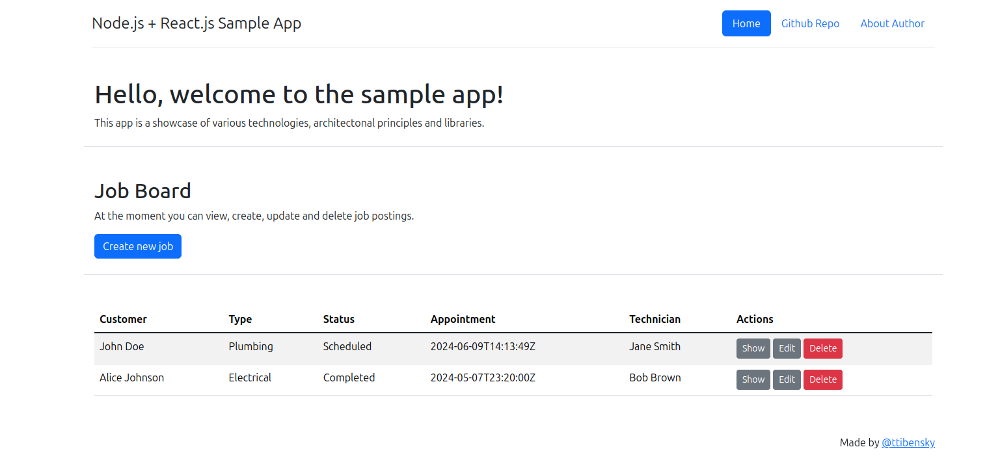

# Node.js + React.js Sample App

This repository is a showcase of various technologies, architectural principles and libraries.
It utilizes:

- languages:
  - [JavaScript](https://javascript.info/)
  - [TypeScript](https://www.typescriptlang.org/)
- frameworks
  - [Nest.js](nestjs.com) for easier development
  - [React.js](https://react.dev/)
  - [Vite](https://vitejs.dev/) for fast build, project startup and updates
- architecture:
  - [Domain-driven Design (DDD)](https://en.wikipedia.org/wiki/Domain-driven_design) to separate business logic from framework and libraries, improve readability, extendability and maintainability, and to enforce [SOLID principles](https://en.wikipedia.org/wiki/SOLID)
  - [Hexagonal Architecture](https://en.wikipedia.org/wiki/Hexagonal_architecture_(software)) for better code organizing (this goes hand in hand with DDD)
  - [Command and Query Responsibility Segregation (CQRS)](https://en.wikipedia.org/wiki/Command_Query_Responsibility_Segregation) to create clear interfaces to read and modify data
  - [Value Objects](https://en.wikipedia.org/wiki/Value_object) to enforce data integrity througout the application and provide easier means to add functionality and/or validation
- libraries:
  - [@nestjs/mongoose](https://www.npmjs.com/package/@nestjs/mongoose) and [mongoose](https://www.npmjs.com/package/mongoose) as an ODM for storing and retrieving data
  - [@nestjs/swagger](https://www.npmjs.com/package/@nestjs/swagger) to generate API documentation from the code
  - [class-validator](https://www.npmjs.com/package/class-validator) to validate requests/user inputs before the data goes to the controllers
  - [date-fns](https://www.npmjs.com/package/date-fns) to make work with dates easier
  - [purify-ts](https://www.npmjs.com/package/purify-ts) to provide a funcional (and more readable) way of handling and avoiding null values and nested conditions
  - [uuid](https://www.npmjs.com/package/uuid) to generate IDs and primary keys for entities, commands, events and queries
  - [Bootstrap](https://getbootstrap.com/) and [React Bootstrap](https://react-bootstrap.netlify.app/) UI kit, so we don't have to write our own components
  - [React Query](https://tanstack.com/query/v3) for easier communication between components
  - [Axios](https://www.npmjs.com/package/axios) for API calls
- command line utilities:
  - [Docker](https://www.docker.com/) for stable environment
  - [Task](https://taskfile.dev/) for easier command line usage

## Requirements

- install Docker https://docs.docker.com/engine/install/
- install Task https://taskfile.dev/installation (optional)
  - if you don't want to use Task, you will need to type docker commands and their arguments manually

## Start the project

- run `task up`

## Usage

- run `task down up logs` to restart the project and start tailing logs from all containers

### Web, API, Mongo Express

- Frontend [http://localhost:3000](http://localhost:3000)
- Swagger API documentation [http://localhost:3001/api](http://localhost:3001/api)
- Mongo Express [http://localhost:8081](http://localhost:8081)

## TODO

- error handling (e.g. POST /jobs when a mongoose connection fails)
- asynchronous command and event processing
- correlation and causation ids
- event sourcing
- tests
- add graphql (as an alterantive to REST API)
- websockets (for auto-updates after creating/updating/deleting a job)

## Resources

- [https://www.domainlanguage.com/ddd/blue-book/](https://www.domainlanguage.com/ddd/blue-book/)
- [https://docs.nestjs.com/](https://docs.nestjs.com/)
- [https://dev.to/sairyss/domain-driven-hexagon-18g5](https://dev.to/sairyss/domain-driven-hexagon-18g5)